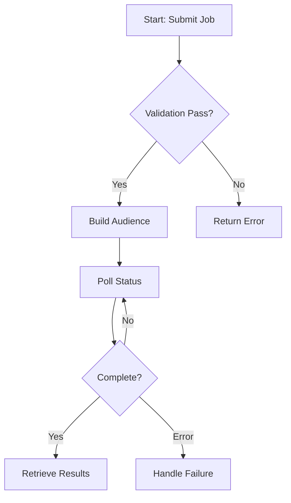
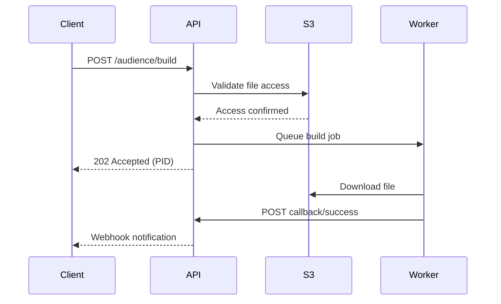
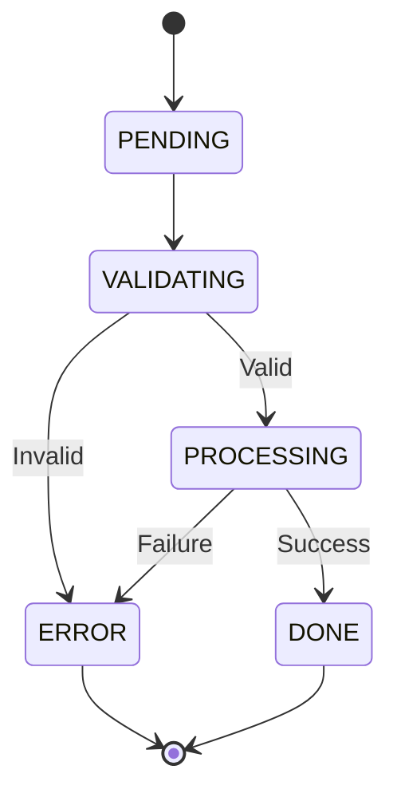
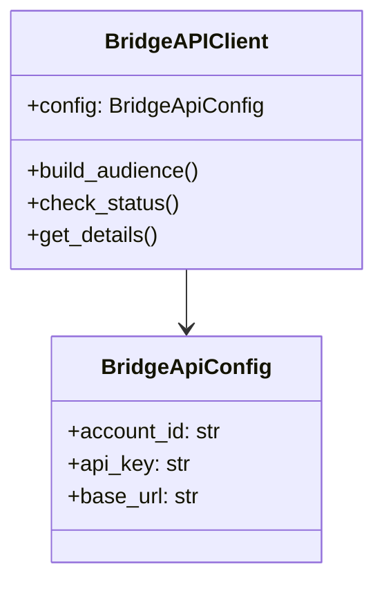

# Diagrams and Tables Reference

This document provides detailed guidelines for using visual elements in technical documentation.

## Mermaid Diagrams

Use Mermaid diagrams to visually communicate complex concepts that are difficult to explain with prose alone. Diagrams should complement, not replace, written explanations.

### When to Use Diagrams

- **Process Flows**: Multi-step workflows with decision points, branching, or loops
- **System Architecture**: Component relationships and interactions
- **State Transitions**: How entities move between different states
- **Sequence of Operations**: Temporal relationships and async interactions
- **Decision Logic**: Complex conditional logic or error handling paths

### Diagram Types

#### 1. Flowcharts

For processes, workflows, and decision logic:

#### 2. Sequence Diagrams

For API interactions, async operations, callback flows:

#### 3. State Diagrams

For status transitions, lifecycle management:

#### 4. Class Diagrams

For data models, inheritance, relationships:

### Diagram Best Practices

- **Keep diagrams focused**: One concept per diagram
- **Limit complexity**: Maximum 10-15 nodes; break complex flows into multiple diagrams
- **Use clear labels**: Node labels should be concise actions (verbs) or states (nouns)
- **Add context**: Always explain what the diagram shows before presenting it
- **Follow conventions**:
  - Flowcharts: Diamonds for decisions, rectangles for actions, rounded for start/end
  - Sequence diagrams: Show temporal order top-to-bottom
  - State diagrams: Show all valid transitions, mark terminal states
- **Test rendering**: Verify Mermaid syntax is correct

### When NOT to Use Diagrams

- Simple linear processes (≤3 steps - use numbered lists)
- Concepts clearer in prose or code examples
- Diagrams requiring extensive legend/explanation
- When diagram would be more complex than the code it represents

## Tables

Use tables when they provide clearer information organization than prose or lists.

### When to Use Tables

#### Parameter Documentation

When documenting multiple parameters with several attributes:

| Parameter | Type | Required | Description |
|-----------|------|----------|-------------|
| `name` | `str` | Yes | Audience name (3-100 chars) |
| `type` | `AudienceType` | No | Defaults to MATCH |

#### Method/Endpoint Reference

Quick reference for multiple endpoints or methods:

| Method | Endpoint | Purpose |
|--------|----------|---------|
| POST | `/audience/build` | Create new audience |
| GET | `/audience/{pid}` | Check status |

#### Status Codes/Error Codes

HTTP status codes, error types, or state enumerations:

| Status | Meaning | Action |
|--------|---------|--------|
| PENDING | Validation in progress | Poll for updates |
| DONE | Processing complete | Retrieve results |

#### Configuration Options

Comparing different configuration choices or settings:

| Option | Default | Description |
|--------|---------|-------------|
| `timeout` | 60 | Request timeout in seconds |
| `retry_count` | 3 | Max retry attempts |

#### Comparison Tables

Feature comparisons, version differences, or option trade-offs:

| Feature | Standard | Premium |
|---------|----------|---------|
| Match rate | 70% | 85% |
| Support | Email | Phone + Email |

### Table Formatting Standards

- Always include header row with descriptive column names
- Use left alignment for text columns, right alignment for numbers
- Use inline code formatting (backticks) for code values, parameters, identifiers
- Keep cell content concise - use bullet points within cells if needed
- Ensure tables are readable in both rendered and raw markdown formats
